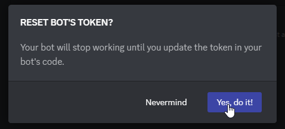
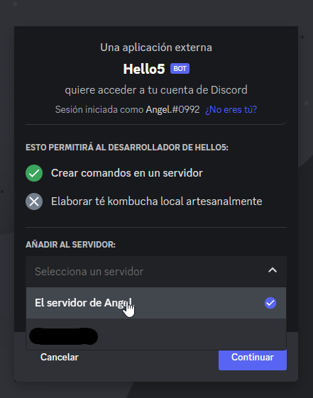

# discord-js-simple-functional-bot

I made this repository for making a bot easily or simply starting with it.

## Resources

For making this bot we are gonna use <a href="https://nodejs.org/en/">Node.js</a>
make sure you install the 'Current' option which is the more stable currently

## Creating your bot

go to <a href="discord.com/developers/applications">Discord Developers Portal</a> and create a new application

Put any name you like in your application

and agree with the **Developer Terms of Service**

### Adding a bot

Once your bot has been created you are gonna go to the left bar and click the 'Bot' tab

And click on the button 'Add Bot'

Then you are going to reset your bot's Token

It's gonna throw a prompt that looks something like this:

Just click yes and copy your token

## URL Generator

Go to the OAuth2 tab

In **Scopes** enable "bot" and "applications.commands"

 

In **Permissions** enable the Perms do you like to have in your bot
im gonna add Administrator **(Not Recomended)** just for this tutorial

In the bottom of the page you can now copy the invite URL for your bot

Paste it in your browser and follow this simple steps

1. Choose a server for your bot to be added

2. Click on continue and then click on authorize

3. Now your bot is in your server!

